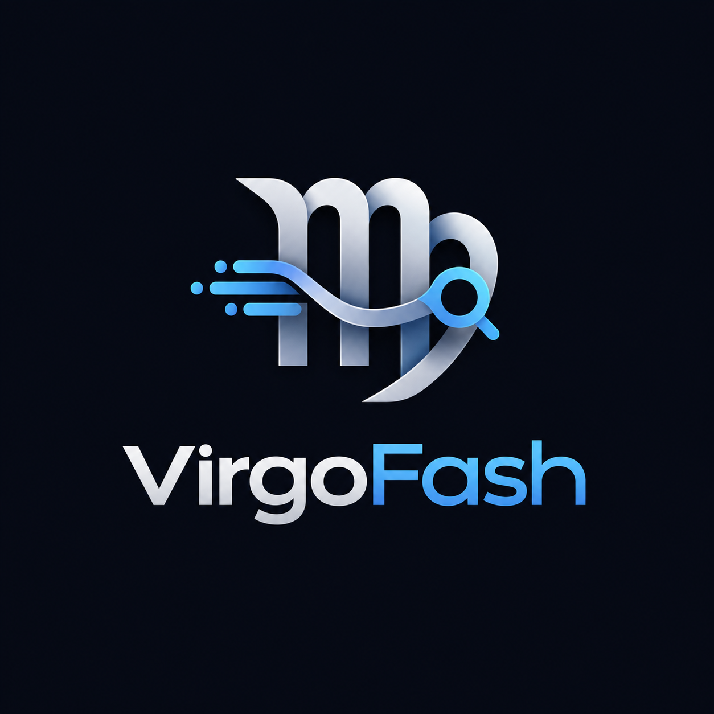

<p align="center">
  
</p>

<h1 align="center">VirgoFash</h1>

<p align="center">
  <b>A lightning-fast, zero-dependency asynchronous search and answer engine built in pure Python.</b>
</p>

<p align="center">
  <a href="https://pypi.org/project/virgofash/"></a>
  <a href="https://pypi.org/project/virgofash/">=3.10"></a>
  <a href="https://github.com/abdullahjahangirai/virgofash/blob/main/LICENSE"></a>
</p>

<p align="center">
  <a href="https://pypi.org/project/virgofash/"><b>PyPI</b></a> •
  <a href="https://github.com/abdullahjahangirai/virgofash"><b>GitHub</b></a> •
  <a href="#quick-start">Quick Start</a> •
  <a href="#ai--rag-integration-anthropic-claude">RAG Integration</a>
</p>

---

## Overview

**VirgoFash** is a modern **Python search library** designed for developers who need a fast, predictable, and dependency-light way to perform **asynchronous web search** directly inside their applications. Built entirely on Python's native `asyncio` and the lightweight `httpx` client, VirgoFash delivers an **async search engine** experience without the overhead of heavyweight scraping frameworks, browser automation, or bloated SDKs.

Whether you're building a **zero-dependency python package** for a CLI tool, powering a research assistant, or wiring up an **LLM RAG integration**, VirgoFash gives you clean, structured, and deterministic search results in just a few lines of code — and integrates seamlessly with **Anthropic Claude integration** patterns to build intelligent AI answer engines.

---

## Table of Contents

- [Core Features](#core-features)
- [Installation](#installation)
- [Quick Start](#quick-start)
- [API Reference](#api-reference)
- [AI / RAG Integration (Anthropic Claude)](#ai--rag-integration-anthropic-claude)
- [Why VirgoFash?](#why-virgofash)
- [Contributing](#contributing)
- [License](#license)
- [Author](#author)

---

## Core Features

### ⚡ Asynchronous Architecture

VirgoFash is built from the ground up on `async` / `await`, powered internally by `httpx.AsyncClient`. Every network call is non-blocking, letting you fire off dozens of concurrent search queries without ever touching a thread pool or blocking your event loop. This makes VirgoFash a natural fit for async web frameworks like FastAPI, Sanic, or any asyncio-based backend service.

```python
results = await search("async python web scraping")
```

### 📦 Zero Heavy Dependencies

No Selenium. No Playwright. No pandas. No bloated transitive dependency trees. VirgoFash ships as a genuinely **zero-dependency python package** at its core (with `httpx` as its only lightweight, async-native requirement), keeping your virtual environment clean, your Docker images small, and your install times fast.

### 🎯 Deterministic Scoring & Ranking

Search results are ranked using a transparent, deterministic scoring algorithm — no hidden black-box heuristics. Every result includes a reproducible relevance score, so the same query under the same conditions always yields the same ordered output. This predictability is critical for testing, caching, and building reliable downstream pipelines like **LLM RAG integration** workflows.

### 🏠 Local-First Design

VirgoFash performs all parsing, scoring, and ranking logic locally in pure Python. There's no external API key required to get started, no vendor lock-in, and no mandatory cloud dependency — you own the entire pipeline from request to ranked result.

---

## Installation

Install VirgoFash directly from PyPI:

```bash
pip install virgofash
```

Or, if you prefer invoking pip through your interpreter:

```bash
python -m pip install virgofash
```

**Requirements:** Python `>=3.10`

---

## Quick Start

Below is a minimal, ready-to-copy example demonstrating how to run an asynchronous search and iterate over the results:

```python
import asyncio
from virgofash import search


async def main():
    query = "best practices for asynchronous python"
    results = await search(query)

    for result in results:
        print(f"Title: {result.title}")
        print(f"URL:   {result.url}")
        print(f"Score: {result.score:.4f}")
        print(f"Snippet: {result.snippet}\n")


if __name__ == "__main__":
    asyncio.run(main())
```

Run it:

```bash
python quickstart.py
```

That's it — no API keys, no configuration files, no setup boilerplate.

---

## API Reference

### `search(query: str, *, limit: int = 10) -> list[SearchResult]`

Performs an asynchronous search and returns a list of ranked `SearchResult` objects.

| Parameter | Type  | Default | Description                              |
|-----------|-------|---------|------------------------------------------|
| `query`   | `str` | —       | The search query string.                 |
| `limit`   | `int` | `10`    | Maximum number of results to return.     |

**`SearchResult`** attributes:

| Attribute | Type    | Description                                  |
|-----------|---------|-----------------------------------------------|
| `title`   | `str`   | The title of the search result.               |
| `url`     | `str`   | The source URL.                               |
| `snippet` | `str`   | A short extracted text snippet.               |
| `score`   | `float` | Deterministic relevance score (higher = better). |

---

## AI / RAG Integration (Anthropic Claude)

One of the most powerful use cases for VirgoFash is turning it into a fully-fledged **AI Answer Engine** by pairing it with the **Anthropic Claude API**. This section walks through building a simple RAG (Retrieval-Augmented Generation) chatbot pipeline: VirgoFash retrieves relevant, real-time snippets from the web, and Claude synthesizes those snippets into a coherent, cited, natural-language answer.

### Step 1 — Install the Anthropic SDK

```bash
pip install anthropic
```

### Step 2 — Retrieve Raw Snippets with VirgoFash

Use VirgoFash's async `search()` function to fetch a set of relevant results for the user's question.

```python
import asyncio
from virgofash import search


async def fetch_context(query: str, limit: int = 5) -> list[str]:
    results = await search(query, limit=limit)
    return [f"[{r.title}]({r.url})\n{r.snippet}" for r in results]
```

### Step 3 — Compile the Retrieved Context

Join the retrieved snippets into a single context block that will be injected into the prompt sent to Claude.

```python
def compile_context(snippets: list[str]) -> str:
    return "\n\n---\n\n".join(snippets)
```

### Step 4 — Pass Context to Claude's Async Client

Use `AsyncAnthropic` to send the compiled context alongside the user's original question, instructing Claude to synthesize an answer grounded in the retrieved sources.

```python
import os
from anthropic import AsyncAnthropic

client = AsyncAnthropic(api_key=os.environ.get("ANTHROPIC_API_KEY"))


async def ask_claude(question: str, context: str) -> str:
    message = await client.messages.create(
        model="claude-sonnet-5",
        max_tokens=1024,
        system=(
            "You are a precise research assistant. Answer the user's question "
            "using ONLY the provided context. Cite sources by URL where relevant."
        ),
        messages=[
            {
                "role": "user",
                "content": f"Context:\n{context}\n\nQuestion: {question}",
            }
        ],
    )
    return "".join(block.text for block in message.content if block.type == "text")
```

### Step 5 — Assemble the Full Answer Engine

Combine all steps into a single asynchronous pipeline: search → compile → synthesize.

```python
import asyncio


async def answer_engine(question: str) -> str:
    snippets = await fetch_context(question)
    context = compile_context(snippets)
    answer = await ask_claude(question, context)
    return answer


async def main():
    question = "What are the advantages of async I/O in Python?"
    answer = await answer_engine(question)
    print(answer)


if __name__ == "__main__":
    asyncio.run(main())
```

With this pattern, VirgoFash acts as the **retrieval layer** and Claude acts as the **reasoning and synthesis layer** — a clean, fully asynchronous foundation for building production-grade **LLM RAG integration** chatbots, research copilots, and intelligent search assistants.

---

## Why VirgoFash?

| | VirgoFash | Traditional Scraping Libraries |
|---|---|---|
| Dependency footprint | Minimal, async-native | Heavy (browser engines, drivers) |
| Concurrency model | Native `asyncio` | Often thread-based or blocking |
| Ranking | Deterministic, reproducible | Often inconsistent or opaque |
| Setup complexity | `pip install` and go | Browser binaries, drivers, configs |
| AI/RAG readiness | Designed for LLM pipelines | Requires custom glue code |

---

## Contributing

Contributions, issues, and feature requests are welcome. Feel free to check the [issues page](https://github.com/abdullahjahangirai/virgofash/issues) or open a pull request.

1. Fork the repository
2. Create your feature branch (`git checkout -b feature/amazing-feature`)
3. Commit your changes (`git commit -m 'Add amazing feature'`)
4. Push to the branch (`git push origin feature/amazing-feature`)
5. Open a Pull Request

---

## License

Distributed under the **MIT License**. See [`LICENSE`](https://github.com/abdullahjahangirai/virgofash/blob/main/LICENSE) for more information.

---

## Author

<p align="center">
  Developed with ❤️ by <b>Abdullah Jahangir</b>
</p>
